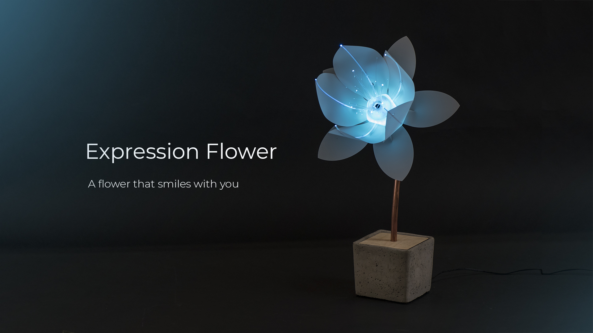
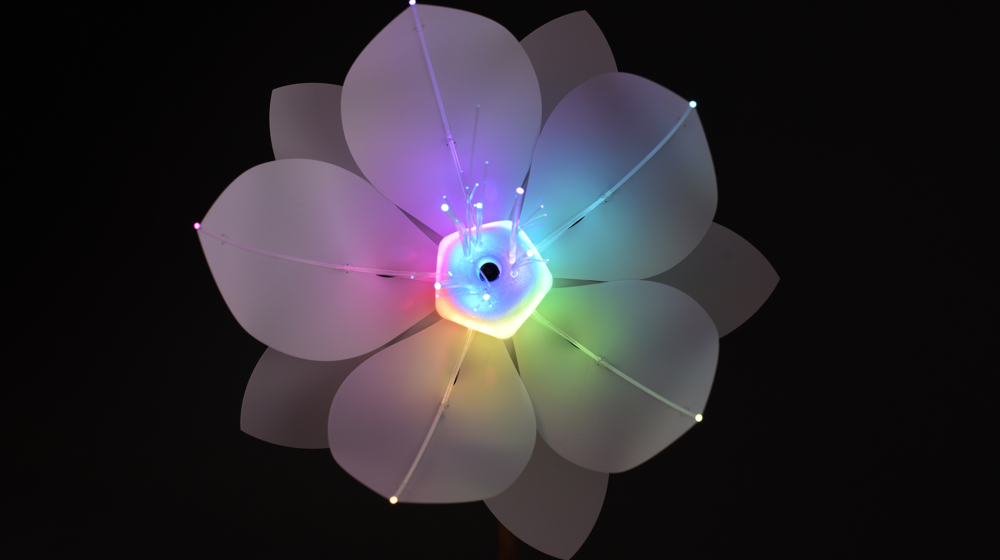
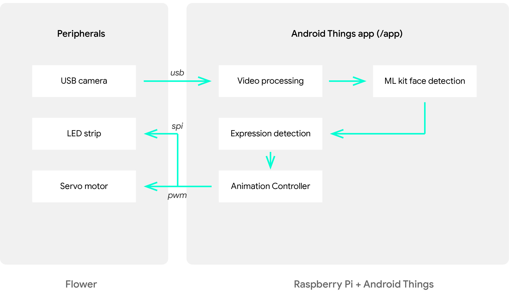
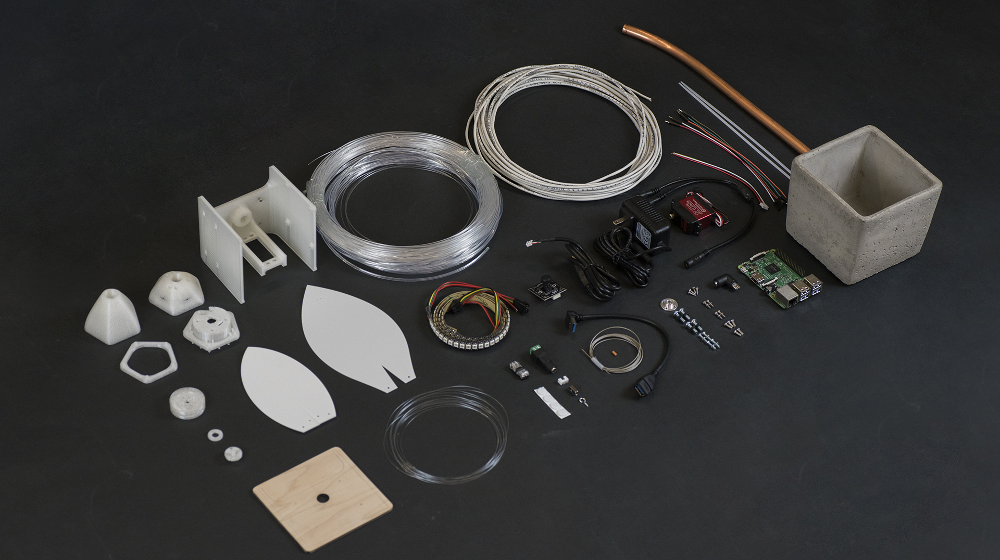

# Android Things Expression Flower



Expression Flower is an interactive object that reacts to your facial expression via color and petal movement using a camera, a servo motor, LEDs, and Android Things.

### About This Document

This document has two sections - How it works, an overview and Make your own, a recipe.
- [The 'how it works' section](#how-it-works) summarises the user interface and technical overview of the Expression Flower.
- [The 'make your own' recipe](#recipe) takes you through the basic steps required to build the Expression Flower and load it with an Android Things app to enable the flower react to facial expressions.

This repository contains instructions, code and fabrication files required to build an Expression Flower. You can build one from scratch or customize any part of it to make your own.
- [Application code](/code)
- [fabrication files](/fabrication)
- [Recipe](https://www.hackster.io/thingsexperiments/expression-flower-md-82210b)

# How It Works

### User Interface


The flower recognizes when a person smiles or winks and displays color and movements (using motor actuation and LEDs).

The flower is constructed of 3D printed, laser cut, and off-the-shelf parts. An embedded USB camera in the flower’s head streams the video to on-device machine learning module to detect the face and infer facial expressions. Once a smile or wink is detected, corresponding reactions control the LEDs color, while a servo motor at the base opens and closes the petals.

### Technical Overview


##### Hardware & firmware
The electronic components are built around a Raspberry Pi 3 Model B, running on Android Things 1.0 (note, Raspberry Pi 3B+ is not yet supported). Android Things is an operating system from Google, designed for embedded devices and the Internet of Things. It serves as the brain for sensing facial expressions, LED light control and motor actuation for the flower petals.

##### Software
The app running on Android Things streams images from the camera to the video processor. The video processor uses Firebase’s MLKit, which performs face detection and expression inference on the images. Once the inference occur the state of the flower changes accordingly. These states include idle, detecting, smile, and wink. Each state is mapped to a different animation sequence which is displayed on the flower via the LEDs and motor.

# How To Make Your Own Expression Flower


This guide gives you an overview of how to create an Expression Flower and load the flower with the Android Things app.

For in-depth, step-by-step instructions see the project [guide on Hackster.io](https://www.hackster.io/thingsexperiments/expression-flower-md-82210b).

##### Step 0. Material preparation


This repository contains a reference design for several 3D printing parts and laser cut files that will be used for later steps. Both 3D printing and laser cutting parts can be fabricated manually, or obtained online. Additional details and specifications can be found in the [fabrication readme](/fabrication) file.

##### Step 1. Flower top assembly


Once all of the required materials have been collected and prepared, assembly the flower head. [View details](https://www.hackster.io/thingsexperiments/expression-flower-md-82210b).

##### Step 2. LED preparation


Cut and solder the LEDs to make a custom LEDs segment that fits 3D printed part. [View details](https://www.hackster.io/thingsexperiments/expression-flower-md-82210b).

#### Step 3. Flower insert assembly


Assemble 3D printed flower top with camera module and LEDs integrated. [View details](https://www.hackster.io/thingsexperiments/expression-flower-md-82210b).

#### Step 4. Flower head assembly


Attach laser cutting petals. [View details](https://www.hackster.io/thingsexperiments/expression-flower-md-82210b).

#### Step 5. Flower stem and base assembly


Build the stem and a base to support the flower and embed electronics. [View details](https://www.hackster.io/thingsexperiments/expression-flower-md-82210b).

#### Step 6. Install Android Things OS


Android Things for Raspberry Pi comes as an image is flashed onto an SD card. The easiest way to do this is to use the android-things-setup-utility, which can be downloaded from the [Android Things Console](https://partner.android.com/things/console/#/tools).

Download it, insert your SD card and run the utility tool as superuser e.g., on Mac
```
sudo ~/Downloads/android-things-setup-utility/android-things-setup-utility-macos
```
or
```
sudo ~/Downloads/android-things-setup-utility/android-things-setup-utility-linux
```
On Windows, right-click the executable file and choose ‘Run as administrator’

When prompted, choose ‘Install Android Things’, ‘Raspberry Pi’ and then ‘Default image' to install Android Things OS onto the SD card.

Once Android Things OS has been installed successfully, insert the SD card into the Raspberry Pi and connect the power.

#### Step 7. Configure Android Things


Once the Android Things image has been flashed on the SD card and inserted into the Raspberry Pi, connect a display, a keyboard, and power up the device.

After Android Things launches, configure Wi-Fi by clicking CONNECT TO NETWORK. Follow the on-screen prompts to complete Wifi setup.

Once your connected to Wi-Fi, open a terminal in your laptop and use ‘adb’ to connect to your Raspberry Pi running Android Things using the following command:

```
adb connect RASPBERRY_PI_WIFI_IP_ADDRESS
```

#### Step 8. Build and install the app


Import the [code](/code) from this repo into [Android Studio](https://developer.android.com/studio/), wait for Gradle to sync.

Before installing the app on Android Things, we need to setup Firebase and import the configuration into the project. This enables the ML kit API to running on the device. Follow the [code readme](/code) file to complete app setup.

Once finished, choose the app Run Configuration in the menu in the toolbar and press run.

When the app is running, the LEDs of the flower should change their color gradually. The video feed from camera shows on the display.

#### Step 9. Setup Expression Flower


Using the keyboard attached to the Raspberry Pi, press the spacebar on the keyboard to enter setup mode. The flower will fully open and an overlay shows visual feedback on the display.

Orient the flower so the camera can see a full face in the center of the circle. Make sure there are no fiber optic cables inside the circle blocking the camera's view.


Insert the loose end of actuation wire into the pulley, then attach the pulley to the servo. Next, tighten the cable end, ensuring the wire is straight down to the pulley and not wrapping around it. Press the spacebar on the keyboard one more time to exit setup mode.

#### Step 10. Move flower to pot


Turn off the power, unplug display and keyboard. Wire the power cable through the bottom of flower pot, then place your flower into the pot, connect power cable and turn the power on. The app will run automatically and your Expression Flower is ready to go.


---

### Notes
This is an experimental project by Android Things Experiments and not an official Google product.

Android Things Experiments, unlike samples, are not maintained after publication and don't necessarily follow all the recommended platform patterns. Please refer to samples, codelabs and documentation if you are looking for reusable reference code.

We encourage open sourcing projects as a way of learning from each other. Please respect our and other creators’ rights, including copyright and trademark rights when present when sharing these works and creating derivative work. If you want more info on Google's policy, you can find it [here](https://www.google.com/permissions/). To contribute to the project, please refer to the [contributing](CONTRIBUTING.md) document in this repository.
